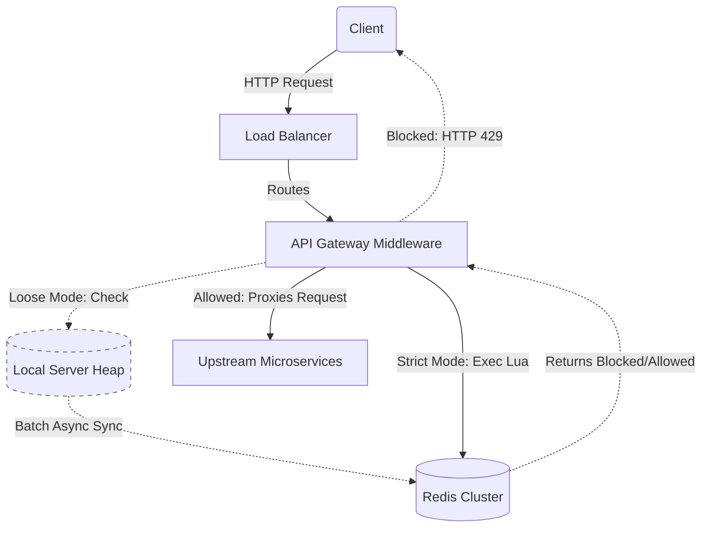
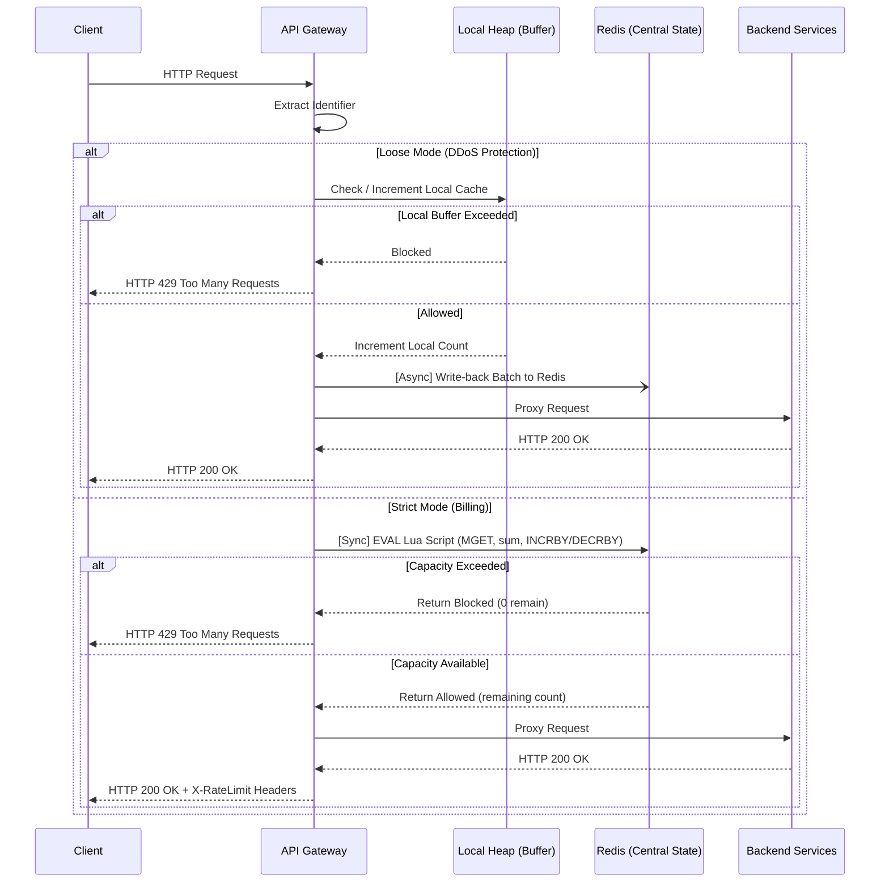

# Distributed Rate Limiter - Architecture Specification

<!-- MODEL_CONTEXT
project: distributed-rate-limiter
languages: [node.js, go]
middleware_pattern: express-style (req, res, next)
state_store: redis (with lua scripts)
algorithm: sliding_window_counter
enforcement_modes: [strict, loose]
max_latency_ms: 5
fail_strategy: fail_open
-->

This document serves as the living design document for the rate limiter. We will iterate on this before writing any code to ensure edge cases are handled elegantly at the system level.

---

## 1. High-Level System Flow

<!-- IMPL_TAG: gateway_middleware -->

1. **Client Request:** A client sends an HTTP request to the API.
2. **Gateway Interception:** The Node.js/Go API Gateway intercepts the request *before* routing it to the upstream service.
3. **Identifier Extraction:** The Gateway extracts the user identifier (either an Authorization token/API Key for authenticated routes, or the client IP address for open routes).
4. **Redis Lua Execution:** The Gateway executes the sliding-window Lua script on the central Redis cluster, passing the identifier.
5. **Decision:**
   - **If Allowed:** The Gateway adds rate-limit tracking headers (e.g., `X-RateLimit-Remaining`) and proxies the request to the upstream backend service.
   - **If Blocked:** The Gateway immediately returns an HTTP 429 response, short-circuiting the request and protecting the backend.

### Architecture Flow Diagram


### Request Lifecycle Sequence


---

## 2. Core Rate Limiting Algorithm

<!-- IMPL_TAG: algorithm_core -->

| Parameter | Value | Rationale |
| :--- | :--- | :--- |
| Algorithm | Sliding Window Counter | Smooths burst traffic without high RAM cost |
| Segment Size | 1 minute | Granular enough to prevent boundary bursts |
| Window Size | 5 minutes (5 segments) | Standard API rate-limit period |
| Rejected | Fixed Window | Vulnerable to boundary burst exploit |
| Rejected | Sliding Window Log | O(n) memory per user (stores every timestamp) |

* **Algorithm Chosen:** Sliding Window Counter (Approximated with 1-minute segments combined to enforce a larger 5-minute rolling window).
* **Rationale:** Provides smoothing over burst traffic (unlike Fixed Windows) without the immense RAM requirements of storing every single timestamp (unlike Sliding Window Logs).

**Segment Calculation (Critical Math):**
```
current_segment = floor(unix_epoch_seconds / 60) * 60
```
> All requests within the same 60-second window will produce the identical `current_segment` integer, regardless of the exact second they arrive.

---

## 3. Data Schema & State Management (Redis)

<!-- IMPL_TAG: redis_schema -->

### Key Structure

| Field | Format | Example |
| :--- | :--- | :--- |
| Authenticated API | `rate_limit::{user_id}::{segment}` | `rate_limit::user_123::1710000300` |
| Open API | `rate_limit::{ip_address}::{segment}` | `rate_limit::192.168.1.1::1710000300` |
| Value | Integer (request count for segment) | `47` |
| TTL | 300 seconds (5 minutes) | Auto-expires via `SETEX` |

* **Format:** `rate_limit::{identifier}::{timestamp_segment}`
    * If authenticated API: `identifier` = `user_id` (e.g., `rate_limit::user_123::1710000300`)
    * If open API: `identifier` = `ip_address` (e.g., `rate_limit::192.168.1.1::1710000300`)
* **Value:** A simple string/integer representing the request `count` for that specific time segment.
    * *Note: The exact expiration time is not inherently stored in the value, as Redis manages the TTL on the key itself, but the Lua script can return it to the client.*

### Atomicity & Garbage Collection

<!-- IMPL_TAG: lua_script -->

**Lua Script Execution (Sliding Window Strategy):**

```
PSEUDOCODE: rate_limit.lua
─────────────────────────────────────────────────────
INPUTS:
  KEYS[1]  = identifier (user_id or ip_address)
  ARGV[1]  = MAX_LIMIT (e.g., 100)
  ARGV[2]  = batch_count (1 for Strict, N for Loose)

STEP 1 — Get Server Time (prevent clock drift):
  current_time    = redis.call('TIME')[1]
  current_segment = floor(current_time / 60) * 60

STEP 2 — Build 5 Segment Keys:
  FOR i = 0 to 4:
    keys[i] = "rate_limit::" .. identifier .. "::" .. (current_segment - i * 60)

STEP 3 — Fetch All Counts Atomically:
  counts = redis.call('MGET', keys[0], keys[1], keys[2], keys[3], keys[4])

STEP 4 — Sum Rolling Usage:
  total_usage = SUM(counts)  -- treat nil as 0

STEP 5 — Enforce Limit:
  IF (total_usage + batch_count) > MAX_LIMIT:
    RETURN { "BLOCKED", 0, ttl_of_oldest_key }

STEP 6 — Increment Current Segment:
  IF NOT EXISTS(keys[0]):
    redis.call('SETEX', keys[0], 300, 0)   -- 5-min TTL
  redis.call('INCRBY', keys[0], batch_count)

STEP 7 — Return Success:
  remaining = MAX_LIMIT - (total_usage + batch_count)
  RETURN { "ALLOWED", remaining, ttl_of_oldest_key }
─────────────────────────────────────────────────────
```

**Key Design Decisions:**
* The same Lua script serves both `Strict` (`batch_count = 1`) and `Loose` (`batch_count = N`) modes. One script, two middlewares.
* `MGET` fetches all 5 segment counts in a single Redis round-trip.
* `SETEX` on creation delegates garbage collection entirely to Redis's native TTL eviction. No background cleanup jobs needed.

---

## 4. Resilience & Fallbacks

<!-- IMPL_TAG: error_handling -->

| Scenario | Behavior | Rationale |
| :--- | :--- | :--- |
| Redis cluster unreachable | **Fail-Open:** Allow the request | Availability > strict enforcement |
| Redis response > 5ms | **Fail-Open:** Allow + log error async | Protect gateway latency budget |
| Server clock drift | Use Redis `TIME` command in Lua | Single authoritative clock source |

* **Fail-Open Strategy:** If the Redis cluster crashes or becomes unreachable, the API Gateway *must* default to allowing traffic through (availability over strict enforcement).
* **Latency Boundaries:** The Redis check must complete within `5ms`. If it times out, the system assumes the request is allowed (fail-open) and logs an error asynchronously.
* **Clock Drift Mitigation:** The Lua validation script will rely strictly on the Redis Server's internal clock (`TIME` command) rather than the individual gateway server instances, preventing desynchronization.

---

## 5. API Gateway HTTP Responses

<!-- IMPL_TAG: http_response_headers -->

When a client hits the gateway, standard HTTP headers must be returned so the client can react programmatically.

### Success (HTTP 200/OK)
The request is proxied to the backend, but the client receives these headers on the response:
* `X-RateLimit-Limit`: The total allowed requests per 5-minute rolling window (e.g., 100).
* `X-RateLimit-Remaining`: The exact number of requests remaining in the current window before a block occurs. (Returned from the Lua script).
* `X-RateLimit-Reset`: The Unix Epoch timestamp when the current rolling window's oldest bucket expires, freeing up more capacity.

### Blocked (HTTP 429 Too Many Requests)
The backend is never hit. The Gateway responds immediately with:
* `X-RateLimit-Limit`: Same as above.
* `X-RateLimit-Remaining`: `0`.
* `X-RateLimit-Reset`: Same as above.
* `Retry-After`: The number of seconds the client must wait until enough capacity drops out of the sliding window to make exactly 1 successful request. *(Calculated by finding the oldest 1-minute bucket's TTL).*

---

## 6. Strict vs. Loose Enforcement (Local Heap Optimization)

<!-- IMPL_TAG: enforcement_modes -->

Depending on the business use case, this architecture supports two distinct operating modes:

| Mode | Use Case | Redis Calls | Accuracy | Throughput |
| :--- | :--- | :--- | :--- | :--- |
| **Strict** | Billing / Monetization | Synchronous per request | 100% exact | Lower (bound by Redis RTT) |
| **Loose** | DDoS Protection / Blocking | Async batch (every 50 reqs / 500ms) | ~95-99% approximate | Millions RPS (local heap) |

1. **Strict Mode (Billing / Monetization):** Every single request must synchronously hit the central Redis cluster before proceeding. This guarantees mathematically perfect accuracy and prevents malicious clients from exploiting load-balancer routing to steal extra API calls.
2. **Loose Mode (DDoS Protection / General Blocking):** If strict accuracy isn't required, the API Gateways will utilize a **Local Server Heap** as a buffer. The gateway counts requests locally in RAM and periodically syncs (write-back) to Redis in batches (e.g., every 50 requests or 500ms). This drastically reduces Redis CPU overhead and network I/O, allowing the system to handle millions of requests per second—at the acceptable cost of minor, transient synchronization lag across servers.

---

## 7. Improvements or Future Scope

<!-- IMPL_TAG: future_scope -->

Even though this architecture is production-ready, there are a few advanced improvements and known trade-offs we can address in the future:

### 1. The "Hot Key" Problem
If a specific API key or IP is being hammered (e.g., a targeted DDoS attack or a massive, sudden spike from a popular client), all requests for that identifier will be routed to the exact same Redis shard.
* **The Challenge:** A standard Redis cluster can struggle if a single shard is forced to process 100k+ requests per second for a single key.
* **The Fix:** In *Loose Mode*, the local server heap absorbs the brunt of this attack flawlessly. In *Strict Mode*, we would need to implement Global vs. Regional Redis instances, or rely on layer 4/7 ingress filtering (like AWS WAF or Cloudflare) to drop the traffic before it even hits our API Gateway.

### 2. Memory Footprint Optimization
While storing individual top-level keys (`rate_limit::user::timestamp`) is incredibly fast and allows Redis to automatically garbage collect via `TTL`, it does come with a higher memory footprint overhead.
* **Calculation:** If you have 1 million active concurrent users, and 5 buckets (keys) per user, that is 5 million active keys in Redis.
* **Future Optimization:** If memory limits become a physical constraint, we could migrate to a **Redis Hash** where the key is the `user_id` and the fields are the timestamps. While this requires us to write a custom background worker to clean up expired fields (preventing a memory leak), it is vastly more memory-efficient than storing 5 million separate top-level object keys.