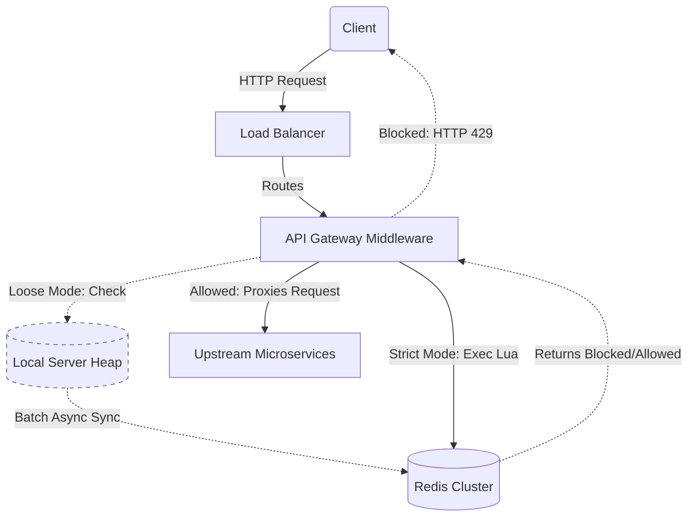
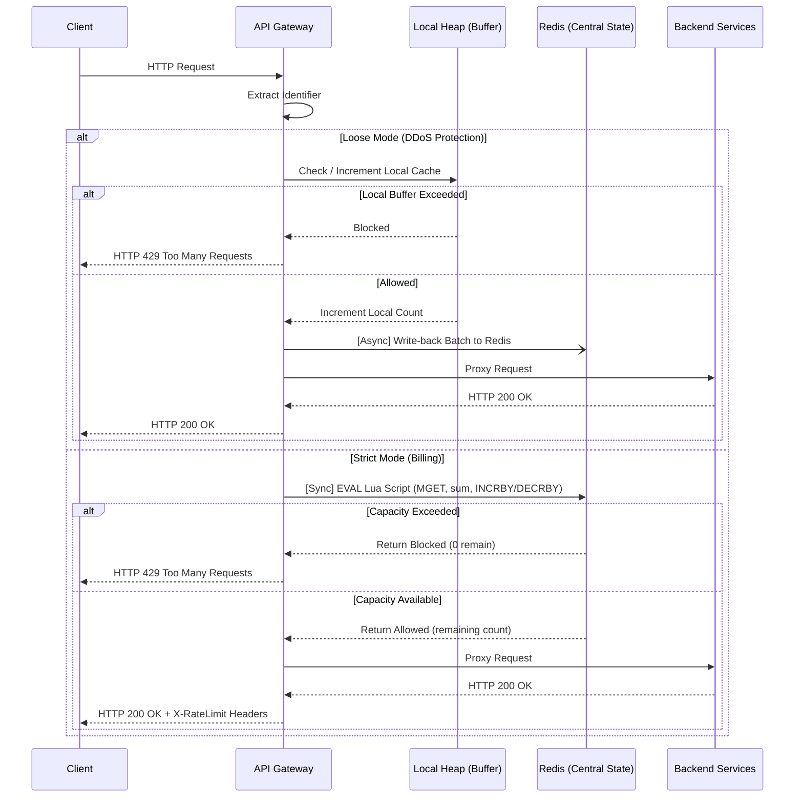
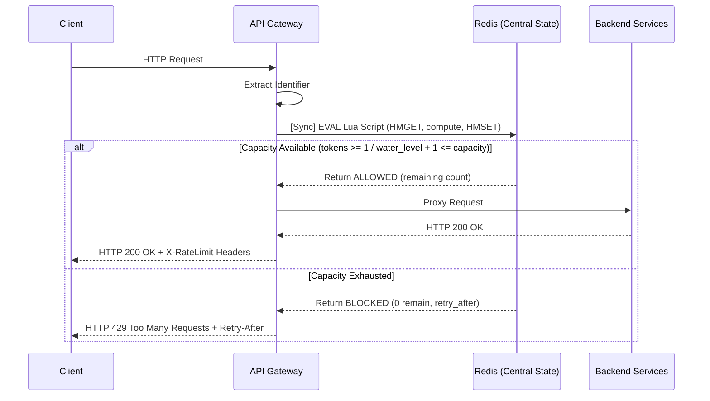
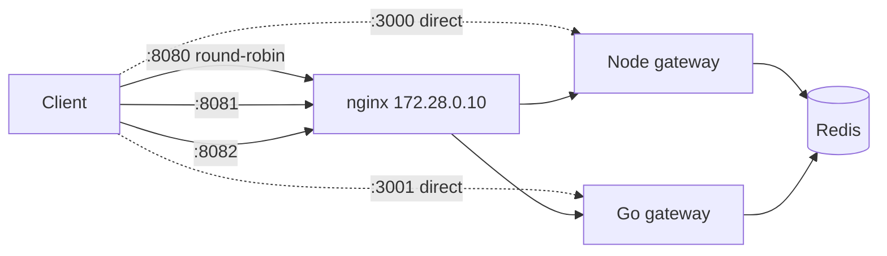

# Distributed Rate Limiter - Architecture Specification

<!-- MODEL_CONTEXT
project: distributed-rate-limiter
languages: [node.js, go]
middleware_pattern: express-style (req, res, next)
state_store: redis (with lua scripts)
algorithm: sliding_window_counter
enforcement_modes: [strict, loose]
max_latency_ms: 5
fail_strategy: fail_open
-->

This document serves as the living design document for the rate limiter. We will iterate on this before writing any code to ensure edge cases are handled elegantly at the system level.

---

## 1. High-Level System Flow

<!-- IMPL_TAG: gateway_middleware -->

1. **Client Request:** A client sends an HTTP request to the API.
2. **Gateway Interception:** The Node.js/Go API Gateway intercepts the request *before* routing it to the upstream service.
3. **Identifier Extraction:** The Gateway extracts the user identifier (either an Authorization token/API Key for authenticated routes, or the client IP address for open routes).
4. **Redis Lua Execution:** The Gateway executes the sliding-window Lua script on the central Redis cluster, passing the identifier.
5. **Decision:**
   - **If Allowed:** The Gateway adds rate-limit tracking headers (e.g., `X-RateLimit-Remaining`) and proxies the request to the upstream backend service.
   - **If Blocked:** The Gateway immediately returns an HTTP 429 response, short-circuiting the request and protecting the backend.

### Architecture Flow Diagram


### Request Lifecycle Sequence


---

## 2. Core Rate Limiting Algorithm

<!-- IMPL_TAG: algorithm_core -->

| Parameter | Value | Rationale |
| :--- | :--- | :--- |
| Algorithm | Sliding Window Counter | Smooths burst traffic without high RAM cost |
| Segment Size | 1 minute | Granular enough to prevent boundary bursts |
| Window Size | 5 minutes (5 segments) | Standard API rate-limit period |
| Rejected | Fixed Window | Vulnerable to boundary burst exploit |
| Rejected | Sliding Window Log | O(n) memory per user (stores every timestamp) |

* **Algorithm Chosen:** Sliding Window Counter (Approximated with 1-minute segments combined to enforce a larger 5-minute rolling window).
* **Rationale:** Provides smoothing over burst traffic (unlike Fixed Windows) without the immense RAM requirements of storing every single timestamp (unlike Sliding Window Logs).

**Segment Calculation (Critical Math):**
```
current_segment = floor(unix_epoch_seconds / 60) * 60
```
> All requests within the same 60-second window will produce the identical `current_segment` integer, regardless of the exact second they arrive.

---

## 3. Data Schema & State Management (Redis)

<!-- IMPL_TAG: redis_schema -->

### Key Structure

| Field | Format | Example |
| :--- | :--- | :--- |
| Authenticated API | `rate_limit::{user_id}::{segment}` | `rate_limit::user_123::1710000300` |
| Open API | `rate_limit::{ip_address}::{segment}` | `rate_limit::192.168.1.1::1710000300` |
| Value | Integer (request count for segment) | `47` |
| TTL | 300 seconds (5 minutes) | Auto-expires via `SETEX` |

* **Format:** `rate_limit::{identifier}::{timestamp_segment}`
    * If authenticated API: `identifier` = `user_id` (e.g., `rate_limit::user_123::1710000300`)
    * If open API: `identifier` = `ip_address` (e.g., `rate_limit::192.168.1.1::1710000300`)
* **Value:** A simple string/integer representing the request `count` for that specific time segment.
    * *Note: The exact expiration time is not inherently stored in the value, as Redis manages the TTL on the key itself, but the Lua script can return it to the client.*

### Atomicity & Garbage Collection

<!-- IMPL_TAG: lua_script -->

**Lua Script Execution (Sliding Window Strategy):**

```
PSEUDOCODE: rate_limit.lua
─────────────────────────────────────────────────────
INPUTS:
  KEYS[1]  = identifier (user_id or ip_address)
  ARGV[1]  = MAX_LIMIT (e.g., 100)
  ARGV[2]  = batch_count (1 for Strict, N for Loose)

STEP 1 — Get Server Time (prevent clock drift):
  current_time    = redis.call('TIME')[1]
  current_segment = floor(current_time / 60) * 60

STEP 2 — Build 5 Segment Keys:
  FOR i = 0 to 4:
    keys[i] = "rate_limit::" .. identifier .. "::" .. (current_segment - i * 60)

STEP 3 — Fetch All Counts Atomically:
  counts = redis.call('MGET', keys[0], keys[1], keys[2], keys[3], keys[4])

STEP 4 — Sum Rolling Usage:
  total_usage = SUM(counts)  -- treat nil as 0

STEP 5 — Enforce Limit:
  IF (total_usage + batch_count) > MAX_LIMIT:
    RETURN { "BLOCKED", 0, ttl_of_oldest_key }

STEP 6 — Increment Current Segment:
  IF NOT EXISTS(keys[0]):
    redis.call('SETEX', keys[0], 300, 0)   -- 5-min TTL
  redis.call('INCRBY', keys[0], batch_count)

STEP 7 — Return Success:
  remaining = MAX_LIMIT - (total_usage + batch_count)
  RETURN { "ALLOWED", remaining, ttl_of_oldest_key }
─────────────────────────────────────────────────────
```

**Key Design Decisions:**
* The same Lua script serves both `Strict` (`batch_count = 1`) and `Loose` (`batch_count = N`) modes. One script, two middlewares.
* `MGET` fetches all 5 segment counts in a single Redis round-trip.
* `SETEX` on creation delegates garbage collection entirely to Redis's native TTL eviction. No background cleanup jobs needed.

---

## 4. Resilience & Fallbacks

<!-- IMPL_TAG: error_handling -->

| Scenario | Behavior | Rationale |
| :--- | :--- | :--- |
| Redis cluster unreachable | **Fail-Open:** Allow the request | Availability > strict enforcement |
| Redis response > 5ms | **Fail-Open:** Allow + log error async | Protect gateway latency budget |
| Server clock drift | Use Redis `TIME` command in Lua | Single authoritative clock source |

* **Fail-Open Strategy:** If the Redis cluster crashes or becomes unreachable, the API Gateway *must* default to allowing traffic through (availability over strict enforcement).
* **Latency Boundaries:** The Redis check must complete within `5ms`. If it times out, the system assumes the request is allowed (fail-open) and logs an error asynchronously.
* **Clock Drift Mitigation:** The Lua validation script will rely strictly on the Redis Server's internal clock (`TIME` command) rather than the individual gateway server instances, preventing desynchronization.

---

## 5. API Gateway HTTP Responses

<!-- IMPL_TAG: http_response_headers -->

When a client hits the gateway, standard HTTP headers must be returned so the client can react programmatically.

### Success (HTTP 200/OK)
The request is proxied to the backend, but the client receives these headers on the response:
* `X-RateLimit-Limit`: The total allowed requests per 5-minute rolling window (e.g., 100).
* `X-RateLimit-Remaining`: The exact number of requests remaining in the current window before a block occurs. (Returned from the Lua script).
* `X-RateLimit-Reset`: The Unix Epoch timestamp when the current rolling window's oldest bucket expires, freeing up more capacity.

### Blocked (HTTP 429 Too Many Requests)
The backend is never hit. The Gateway responds immediately with:
* `X-RateLimit-Limit`: Same as above.
* `X-RateLimit-Remaining`: `0`.
* `X-RateLimit-Reset`: Same as above.
* `Retry-After`: The number of seconds the client must wait until enough capacity drops out of the sliding window to make exactly 1 successful request.

**How the Lua script computes both times.** A segment starting at time `S` stays in the 5-minute window until `S + 300`. Key TTLs aren't used: a key's TTL counts from the segment's first write, so it can overstate the exit time by up to 60 s.
* **Reset:** the exit time of the oldest segment that has any usage.
* **Retry-After:** walk the segments oldest-first, adding up their counts until the freed total covers the shortfall (`usage + batch − limit`). The answer is when the segment that crosses that line exits.
* **Loose mode:** a rejection is decided locally. Its Retry-After is the precise value from the last write-back that came back BLOCKED. If none has, the answer is 1 s, because the next write-back (at most one 500 ms tick away) will know.

---

## 6. Strict vs. Loose Enforcement (Local Heap Optimization)

<!-- IMPL_TAG: enforcement_modes -->

Depending on the business use case, this architecture supports two distinct operating modes:

| Mode | Use Case | Redis Calls | Accuracy | Throughput |
| :--- | :--- | :--- | :--- | :--- |
| **Strict** | Billing / Monetization | Synchronous per request | 100% exact | Lower (bound by Redis RTT) |
| **Loose** | DDoS Protection / Blocking | Async batch (every 50 reqs / 500ms) | ~95-99% approximate | Millions RPS (local heap) |

1. **Strict Mode (Billing / Monetization):** Every single request must synchronously hit the central Redis cluster before proceeding. This guarantees mathematically perfect accuracy and prevents malicious clients from exploiting load-balancer routing to steal extra API calls.
2. **Loose Mode (DDoS Protection / General Blocking):** If strict accuracy isn't required, the API Gateways will utilize a **Local Server Heap** as a buffer. The gateway counts requests locally in RAM and periodically syncs (write-back) to Redis in batches (e.g., every 50 requests or 500ms). This drastically reduces Redis CPU overhead and network I/O, allowing the system to handle millions of requests per second—at the acceptable cost of minor, transient synchronization lag across servers.

#### Loose-mode write-back protocol

The Lua script runs in one of two modes, chosen by `ARGV[3]`:

| Mode | Used by | Batch over the limit | Returns |
| :--- | :--- | :--- | :--- |
| `check` (default) | Strict, batch of 1 | Rejected, **not recorded**: the request has not been served yet | `ALLOWED`/`BLOCKED`, remaining, TTL |
| `writeback` | Loose flush | **Always recorded**: those requests were already served, so Redis must count them | Cluster-wide `remaining` after recording (0 if at or over the limit) |

Each gateway instance keeps a per-identifier **allowance**: the number of requests it may still admit without asking Redis.

1. **Admit:** decrement the allowance. If it would drop below 0, reject locally without a network call, and don't count the rejected request.
2. **Write-back:** every flush, whether triggered by 50 pending requests or by the 500 ms tick, sends the pending batch in `writeback` mode. The allowance is then reset to Redis's `remaining`, minus any requests admitted while the call was in flight. An instance therefore learns what the *other* instances have used at every sync.
3. **Refresh:** an exhausted identifier with nothing pending sends an empty write-back (batch 0) every 5 s, so it unblocks when window segments expire instead of staying blocked.
4. **Fallback:** if an identifier hasn't had a successful sync in a whole window (300 s, e.g. Redis down), its allowance resets to the full limit. This is fail-open, consistent with §4.

**Overshoot bound:** a new identifier starts with the full allowance, because its cluster usage is unknown. So each instance can admit at most one batch (50 requests), or one flush interval's worth, beyond the limit before its first sync corrects it. That replaces the earlier bound of N × limit across N instances.

---

## 7. Additional Rate Limiting Algorithms

<!-- IMPL_TAG: additional_algorithms -->

In addition to the Sliding Window Counter, this project implements two more rate limiting algorithms as separate middlewares. Each algorithm serves different use cases and has distinct performance characteristics.

### Algorithm Comparison

| Property | Sliding Window Counter | Token Bucket | Leaky Bucket |
| :--- | :--- | :--- | :--- |
| **Best For** | Quota enforcement over time windows | Burst-tolerant API rate limiting | Steady-rate output enforcement |
| **Burst Handling** | Smoothed (segments prevent boundary bursts) | Allows controlled bursts (spend saved tokens) | No bursts — constant drain rate |
| **Memory Per User** | 5 String keys (one per segment) | 1 Hash key (2 fields) | 1 Hash key (2 fields) |
| **Enforcement Modes** | Strict + Loose | Strict only | Strict only |
| **Parameters** | `max_limit`, `window_segments` | `capacity`, `refill_rate` | `capacity`, `leak_rate` |
| **Time Precision** | Seconds (60s segments) | Sub-second (microseconds) | Sub-second (microseconds) |

> **Why Strict Only for Token Bucket & Leaky Bucket?** These algorithms maintain continuous state (token count, water level) that changes with every request. In loose mode, each gateway server would maintain its own bucket state, effectively multiplying the rate limit by the number of servers. The drift is unbounded — unlike the sliding window counter where loose mode error is bounded to ~5% overshoot.

### Token Bucket Algorithm

**Concept:** Users start with a full bucket of tokens. Each request consumes one token. Tokens refill at a steady rate. When the bucket is empty, requests are blocked until tokens refill.

**Parameters:**
* `capacity` — Maximum tokens the bucket can hold (also the burst limit)
* `refill_rate` — Tokens added per second

**Redis Schema:**
| Field | Format | Example |
| :--- | :--- | :--- |
| Key | `token_bucket::{identifier}` | `token_bucket::user_123` |
| Hash Fields | `tokens` (float), `last_refill` (float timestamp) | `tokens: 7.5`, `last_refill: 1710000300.123` |
| TTL | `ceil(capacity / refill_rate)` seconds | Auto-expires idle users |

```
PSEUDOCODE: token_bucket.lua
─────────────────────────────────────────────────────
INPUTS:
  KEYS[1]  = identifier (user_id or ip_address)
  ARGV[1]  = capacity (e.g., 10)
  ARGV[2]  = refill_rate (e.g., 1 token/sec)

STEP 1 — Get Server Time (sub-second precision):
  now = redis.call('TIME')[1] + redis.call('TIME')[2] / 1e6

STEP 2 — Read State:
  HMGET token_bucket::{identifier} → tokens, last_refill

STEP 3 — Initialize First Request:
  IF state is nil: tokens = capacity, last_refill = now

STEP 4 — Refill Tokens:
  elapsed = now - last_refill
  tokens = MIN(capacity, tokens + elapsed * refill_rate)

STEP 5 — Enforce Limit:
  IF tokens < 1:
    RETURN { "BLOCKED", 0, ceil((1 - tokens) / refill_rate) }

STEP 6 — Consume Token:
  tokens = tokens - 1
  HMSET + EXPIRE

STEP 7 — Return Success:
  RETURN { "ALLOWED", floor(tokens), reset_ttl }
─────────────────────────────────────────────────────
```

### Leaky Bucket Algorithm

**Concept:** Requests fill a bucket that leaks at a constant rate. If the bucket overflows, requests are blocked. This enforces a perfectly steady output rate regardless of input burst patterns.

**Parameters:**
* `capacity` — Maximum bucket size (queue depth)
* `leak_rate` — Requests drained per second

**Redis Schema:**
| Field | Format | Example |
| :--- | :--- | :--- |
| Key | `leaky_bucket::{identifier}` | `leaky_bucket::user_123` |
| Hash Fields | `water_level` (float), `last_leak` (float timestamp) | `water_level: 3.2`, `last_leak: 1710000300.456` |
| TTL | `ceil(capacity / leak_rate)` seconds | Auto-expires idle users |

```
PSEUDOCODE: leaky_bucket.lua
─────────────────────────────────────────────────────
INPUTS:
  KEYS[1]  = identifier (user_id or ip_address)
  ARGV[1]  = capacity (e.g., 10)
  ARGV[2]  = leak_rate (e.g., 1 request/sec)

STEP 1 — Get Server Time (sub-second precision):
  now = redis.call('TIME')[1] + redis.call('TIME')[2] / 1e6

STEP 2 — Read State:
  HMGET leaky_bucket::{identifier} → water_level, last_leak

STEP 3 — Initialize First Request:
  IF state is nil: water_level = 0, last_leak = now

STEP 4 — Drain Bucket:
  elapsed = now - last_leak
  water_level = MAX(0, water_level - elapsed * leak_rate)

STEP 5 — Enforce Limit:
  IF water_level + 1 > capacity:
    RETURN { "BLOCKED", 0, ceil((water_level + 1 - capacity) / leak_rate) }

STEP 6 — Add Water:
  water_level = water_level + 1
  HMSET + EXPIRE

STEP 7 — Return Success:
  RETURN { "ALLOWED", floor(capacity - water_level), reset_ttl }
─────────────────────────────────────────────────────
```

### Request Lifecycle (Token Bucket / Leaky Bucket)


### Key Design Differences from Sliding Window Counter

| Aspect | Sliding Window Counter | Token Bucket / Leaky Bucket |
| :--- | :--- | :--- |
| **Redis Data Type** | String keys (one per segment) | Hash (single key, multiple fields) |
| **Atomicity** | `MGET` across 5 keys | `HMGET` + `HMSET` on 1 key |
| **Garbage Collection** | Redis TTL on each segment key | Redis `EXPIRE` on hash key |
| **Cluster Compatibility** | Needs hash tags (5 keys may hash to different slots) | Single key per user — no slot issues |
| **State Model** | Additive counters (increment only) | Continuous state (refill/drain over time) |

---

## 8. Improvements or Future Scope

<!-- IMPL_TAG: future_scope -->

Even though this architecture is production-ready, there are a few advanced improvements and known trade-offs we can address in the future:

### 1. The "Hot Key" Problem
If a specific API key or IP is being hammered (e.g., a targeted DDoS attack or a massive, sudden spike from a popular client), all requests for that identifier will be routed to the exact same Redis shard.
* **The Challenge:** A standard Redis cluster can struggle if a single shard is forced to process 100k+ requests per second for a single key.
* **The Fix:** In *Loose Mode*, the local server heap absorbs the brunt of this attack flawlessly. In *Strict Mode*, we would need to implement Global vs. Regional Redis instances, or rely on layer 4/7 ingress filtering (like AWS WAF or Cloudflare) to drop the traffic before it even hits our API Gateway.

### 2. Memory Footprint Optimization
While storing individual top-level keys (`rate_limit::user::timestamp`) is incredibly fast and allows Redis to automatically garbage collect via `TTL`, it does come with a higher memory footprint overhead.
* **Calculation:** If you have 1 million active concurrent users, and 5 buckets (keys) per user, that is 5 million active keys in Redis.
* **Future Optimization:** If memory limits become a physical constraint, we could migrate to a **Redis Hash** where the key is the `user_id` and the fields are the timestamps. While this requires us to write a custom background worker to clean up expired fields (preventing a memory leak), it is vastly more memory-efficient than storing 5 million separate top-level object keys.
---

## 9. Deployment & Benchmark Topology (Docker)

<!-- IMPL_TAG: deployment -->

A single `docker-compose.yml` at the repo root defines two stacks, selected by compose profile.

### Default stack — shared Redis, one front door



* **Both gateways share one Redis.** A client whose requests are spread across a Node and a Go instance is held to one combined quota, which demonstrates the distributed design across two runtimes.
* **nginx routing:** `:8080` round-robins across both gateways, `:8081` goes to Node only, and `:8082` goes to Go only. The `X-Served-By` response header names the backend that handled each request. Each nginx worker keeps its own round-robin position, so a few requests on fresh connections can all land on one backend; under sustained traffic the split evens out (e.g. 54/46 over 105 requests).
* **Proxy trust:** both gateways run with `TRUST_PROXY=172.28.0.10`, which is nginx's fixed address only, not the subnet. Trusting the subnet would let any other container on the network forge `X-Forwarded-For` (bug B4). It would also make safety depend on the source address the Docker platform assigns to host connections on published ports: Docker Desktop uses its host address `192.168.65.1`, outside the subnet, but other setups can use the in-subnet bridge gateway. Both gateways normalize IPv4-mapped IPv6 addresses (`::ffff:a.b.c.d`), so one client keeps one identity whether it arrives directly or through nginx.
* **Loose mode across instances:** every write-back resets each instance's allowance to the cluster-wide remaining capacity (§6), so instances learn about each other's usage. The overshoot a client can get by spreading requests across N instances is bounded by about one batch per instance before the first sync. Write-backs always record served requests, so Redis's count matches the requests actually served.

### Benchmark stack — `--profile bench`, isolated and CPU-pinned

A separate network and a separate Redis. The benchmark script runs one gateway at a time, each pinned to its own CPUs inside the Docker VM:

| Service | `cpuset` | Notes |
|---|---|---|
| `redis-bench` | `0` | Single-threaded main loop |
| `node-bench` / `go-bench` | `1-4` | Same 4-CPU budget for both; Node's event loop can use only one of them |
| `loadgen` | `5-13` | autocannon (for continuity with earlier results) and wrk (multi-threaded, to find the ceiling) |

nginx is not in the benchmark path, so benchmark numbers exclude any proxy cost.

**Caveat:** `cpuset` pins vCPUs *inside* Docker Desktop's Linux VM. The hypervisor still schedules those vCPUs onto the host's mixed performance and efficiency cores, so this isolates the containers from each other, not from the host.

### Images

| Service | Build | Runtime | Rationale |
|---|---|---|---|
| Go gateway | `golang:1.26`, `CGO_ENABLED=0` | `gcr.io/distroless/static-debian12:nonroot` | Static binary, so the runtime base doesn't affect performance; a few MB, runs as non-root, has no shell |
| Node gateway | — | `node:25-slim` (glibc), production dependencies only | Avoids alpine's musl allocator, which would skew Node's benchmark numbers |
| Redis | — | `redis:8.6` | Matches the version used for the native benchmarks |
| nginx | — | `nginx:1.29-alpine` | Proxy only; not in the benchmark path |

Both gateway images are built from the repo root so the shared `lua/` directory is in the build context. `.dockerignore` keeps `.env*`, `node_modules` and `.git` out of every image.


---

## 10. Identity & API-Key Registry

<!-- IMPL_TAG: identity -->

Rate limits apply to an **identity**, resolved per request. Previously, any `X-API-Key` or `Authorization` value became an identity with its own fresh quota, so rotating made-up keys bypassed every limit. Now a key counts only if it is registered.

### Resolution

1. Take the presented key from `X-API-Key`, or failing that from `Authorization: Bearer <key>`. Other auth schemes are ignored.
2. If the key isn't in the generated format (`rlk_` + 32 base62 characters), treat it as unregistered **without** a lookup.
3. Hash it with SHA-256 and look it up in the gateway's local cache, and on a miss in Redis (one round-trip, `lua/resolve_key.lua`).
4. Derive the identity and its sliding-window limit:

| Case | Identity | Sliding-window limit |
| :--- | :--- | :--- |
| No key, unregistered key, malformed key, or lookup failed (Redis down / over the 5 ms budget) | `ip:<client ip>` | `RATE_LIMIT_MAX` (anonymous) |
| Registered, tenant mode `isolated` | `key:<first 16 hex of hash>` | `plan limit` |
| Registered, tenant mode `pooled` | `tenant:<tenant id>` | `plan limit × tenant key slots` |

* **Plan tiers** live in gateway config: `PLAN_LIMITS="free=100,paid=1000"`. A tenant with an unknown plan falls back to the anonymous limit and is logged.
* **Isolated** gives each key its own quota, so a runaway key can't starve its siblings. This fits a tenant who paid per key. **Pooled** gives one shared quota for all of a tenant's keys. This fits free apps, and paid tenants who want flexibility across keys.
* **Token and leaky buckets** resolve the same identity, so the rotation bypass is closed everywhere, but keep their global capacity and rate. They shape traffic to protect the backend, so their numbers come from backend capacity, not billing plans.
* **The loose batch threshold** is per identity: `min(configured threshold, limit / 2)`. Small plan limits keep a proportionally small overshoot bound.

### Registry schema (Redis)

| Key | Type | Fields |
| :--- | :--- | :--- |
| `apikey::<sha256 hex>` | hash | `tenant` |
| `tenant::<id>` | hash | `plan`, `keys` (paid key slots, ≥ 1), `mode` (`isolated` \| `pooled`) |
| `tenant::<id>::keys` | set | hashes of the tenant's keys (listing and revocation) |

Raw keys are never stored. A key is shown once, by the CLI that creates it.

### Cache (per gateway)

* **Entries:** hash → resolved identity and limit, **including "unregistered"** (negative caching). TTL `KEY_CACHE_TTL` (default 30 s). At most `KEY_CACHE_SIZE` entries (default 10,000), evicting the oldest first.
* **What isn't cached:** lookup failures. The request falls back to IP identity and the next request retries the lookup.
* **Revocation and plan changes** take effect within one TTL.
* **Loose mode** stays network-free on cache hits. A miss costs one lookup per key per TTL.
* **Both gateways** deduplicate concurrent misses for the same key, so a burst on a new key produces a single lookup.

### Provisioning

`go/cmd/keyctl`, a CLI that writes to Redis directly. It adds no endpoints to the gateways, and therefore no new attack surface.
* `tenant set <id> --plan <p> --keys <n> --mode <isolated|pooled>`
* `tenant show <id>`
* `key create <tenant>`
* `key revoke <key>`
* `key list <tenant>`

The Docker image ships it next to the gateway: `docker compose exec go /app/keyctl …`.

### Known limitation

A flood of *well-formed* random keys misses the cache on every request, so each one costs a Redis lookup. Loose mode then loses its network-free property for that traffic. The flood is still limited, because unregistered keys fall back to the client's IP identity, but Redis load grows with the flood's rate. A mitigation would be a per-IP budget for cache misses; it is not implemented.
---

## Decision Log

| Date | Decision | Alternatives considered | Rationale |
|---|---|---|---|
| 2026-09-23 | Lua scripts moved to repo-root `lua/`, shared by both gateways | Copy into `go/lua/`; copy plus a drift test | One source of truth; `//go:embed` can't reach outside the module, so Go reads `LUA_DIR` at startup |
| 2026-09-23 | Loose mode tracks a `cumulative` count per local window, separate from the flushed `pending` count | Mirror Node's single counter | Node's single counter made the §6 local guard unreachable (71,622 admitted against a limit of 100); adopted in both gateways on 2026-09-24. **Superseded 2026-09-25** by the allowance synced to Redis (entry below) |
| 2026-09-24 | `TRUST_PROXY` off by default (Express semantics: hop count or IP/CIDR list) | Always trust XFF; never trust XFF | With trust always on, any client could mint a fresh identifier per request; with trust never on, every client behind a load balancer shares one IP |
| 2026-09-25 | Loose write-back always records served requests (`writeback` Lua mode); the local guard is an allowance synced to Redis's `remaining`; exhausted identifiers refresh every 5 s | Keep all-or-nothing batches; unblock only on local window roll | The multi-instance demo showed 153 served but only 77 recorded, and blocked identifiers stayed blocked for up to 300 s even after Redis had capacity again |
| 2026-09-25 | Reset/Retry-After computed from segment exit times (`S + 300`), not key TTLs; loose mode reports the last BLOCKED write-back's value | Oldest key's TTL, defaulting to 60 s | Key TTLs start at a segment's first write, so they overstate the exit by up to 60 s; the oldest slot is often empty (defaulted to 60 s). Also removes a `TTL` call per request |
| 2026-09-25 | API keys validated against a Redis registry with a per-gateway cache (30 s, bounded, negative caching); unknown keys fall back to IP identity | Reject unknown keys with 401; a separate anonymous limit; lookup inside the rate-limit Lua; HMAC-signed keys | Closes key rotation without turning the gateway into an auth service; the cache keeps loose mode network-free on hits; revocation within one TTL is acceptable |
| 2026-09-25 | Quotas belong to a key (`isolated`) or a tenant (`pooled`), chosen per tenant; limits come from plan tiers in config | Always per key; always per tenant; a per-tenant limit field | Paid tenants may buy per-key capacity, while free apps share one quota; tiers keep limit changes to one config edit |
| 2026-09-25 | Plans set sliding-window limits only; every algorithm resolves the same identity | Plans for every algorithm | Closes the bypass everywhere with the smallest change; buckets protect backend capacity, which doesn't depend on a customer's plan |
| 2026-09-25 | Keys provisioned by a Go CLI (`go/cmd/keyctl`; not `cmd/keys`, which collides with the workspace's secrets deny rule for `keys/` directories) | Admin HTTP endpoint | No new attack surface on public gateways |
| 2026-09-25 | Docker default stack uses a shared Redis; benchmark stack is isolated and CPU-pinned | Always shared; separate Redis per gateway | Default stack demonstrates one quota across heterogeneous instances; benchmark stack keeps measurements free of cross-talk |
| 2026-09-25 | nginx: round-robin port plus one port per gateway; trust nginx's single IP | Round-robin only; port per gateway only; trust the whole subnet | Covers both the distributed demo and side-by-side use; trusting the subnet would let any container on the network forge client identity |
| 2026-09-25 | Docker benchmarks use both autocannon and wrk | One tool only | autocannon keeps results comparable with earlier runs; wrk removes the single-threaded client ceiling found in Phase 3 |
| 2026-09-25 | Images: distroless static (Go), `node:25-slim` (Node) | alpine for both; scratch for Go | Small and non-root; glibc keeps Node's allocator behavior representative |
